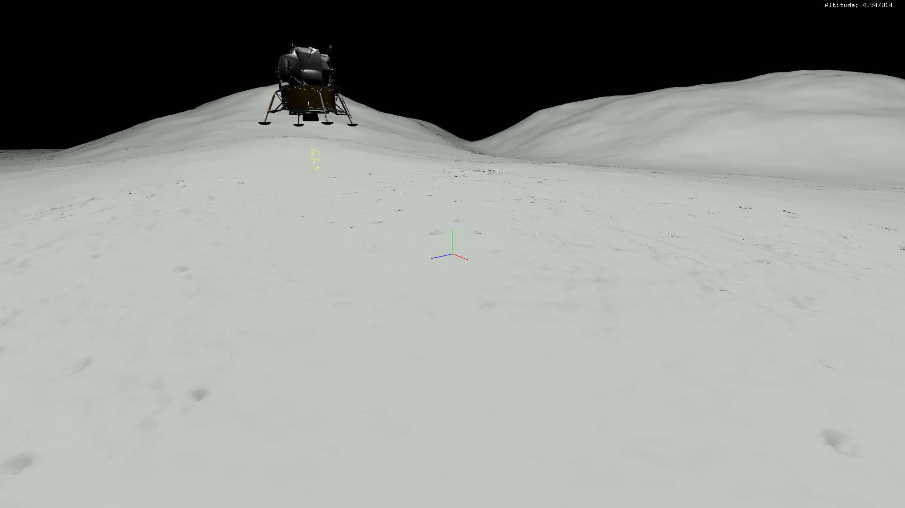

# CS134 SPACE LANDER PROJECT

## Introduction
A 3d simulation game. The goal of this application is to simulate the motion of the lunar lander.  

## Concepts
Basic Physics Engine: Uses kinematic physics.

Octree for collision detection and mouse-ray detection.

Particle System for simulating the thruster flame.

## Controls
To Switch Cameras:
   
     F1 - Main Cam  
     F2 - Front Cam  
     F3 - Bottom Cam  
     F4 - Track Cam
  
Two different ways to control the spacecraft:
  * Arrow Key: 
  
          Up for +y  
          Down for -y  
          Left for -x  
          Right for +x  
          Ctrl + Up for +z  
          Ctrl + Down for -z  
   
  * Mouse Click:

 
 
 
 
The terrain models and the lander model are provided by my CS134 professor. In other words, I did not create the models.
In addition, I do not own the sound file and the TrueType font file.
